# GitHub Fundamentals

#### Objectives

To create an **open source movie recommendation engine** implemented in a microservice architecture. By the end of this workshop, you’ll know how to:

- [X] History of OpenSource - PPT presentation
- [X] How to create an Open Source project
- [X] [Markdown markup language](https://guides.github.com/features/mastering-markdown/)
- [X] [Docker](#1-github-repository---github-templates)
- [X] [Github Repository / Templates](#1-github-repository---github-templates)
- [X] [Microservice](#2-microservice)
- [X] [Github Issues](#3-github-issues)
- [X] [Github Releases / Tag](#4-github-releases--tags)
- [X] [Github Actions](#5-github-actions)
- [X] [Pull Requests](#6-github-pull-request)
- [X] [Github Advanced Search](#7-github-advanced-search)
- [X] [Github Pages](#8-github-pages)
- [X] [Github Wikis](#9-github-wikis)

And you’ll be able to:

- [X] Create an open source project.
- [X] Build a team to collaborate on the project.
- [X] Collaborate on an open source project by creating issues and doing Pull Requests.
- [X] Utilize CI/CD pipelines to build your software with github actions.
- [X] Host your portfolio page.
- [X] Use github’s advanced search.
- [X] User GIT version control.
- [X] Share your software on dockerhub.com
- [X] Build software with Docker.

#### Requirements

- [GitHub](https://github.com/) account
- [DockerHub](https://hub.docker.com/) account

#### Environment

- [O'Reilly's sandbox](https://learning.oreilly.com/scenarios/docker-sandbox/9781492086161)
- [Kata Coda](https://www.katacoda.com/courses/ubuntu/playground2004)

#### Links

- [choosealicense.com](https://choosealicense.com/)
- [Dockerfile](https://docs.docker.com/engine/reference/builder/)
- [Markdown](https://guides.github.com/features/mastering-markdown/#GitHub-flavored-markdown)
- [Jekyll](https://jekyllrb.com/)
- [GitHub Actions Docs](https://docs.github.com/en/actions)
- [GitHub Search Docs](https://docs.github.com/en/github/searching-for-information-on-github/searching-on-github)

# Warning - No licence no Open Source !!!

Choosing the right license when creating an open source project is [crucial](https://docs.github.com/en/github/creating-cloning-and-archiving-repositories/licensing-a-repository#choosing-the-right-license).

> "**without a license**, the default copyright laws apply, meaning that you retain all rights to your source code and **no one may reproduce, distribute, or create derivative works from your work.**"

There are many available [open source licenses](https://opensource.org/licenses). If you are confused which one to use, visit [choosealicense.com](https://choosealicense.com/licenses/) - a comprehensive guide about open source licenses.

Additional information about **legal aspects of having no license** can be found [here](https://opensource.stackexchange.com/questions/1720/what-can-i-assume-if-a-publicly-published-project-has-no-license).

## 1. Github Repository /  GitHub Templates

<details>
  <summary>Context</summary>

  #### What is a GitHub repository?

  A repository is a place where your git **project** and its **files** resides. Typical repository stores source code along with `.git` folder - a directory which tracks snapshot of changes introduced to your files.

  #### Why to use GitHub repository?

  GitHub repository is:
  - A place for documenting your project - **GitHub Wiki**
  - A place for automatizing tasks within software development life cycle - **GitHub Actions**
  - A place for organizing and tracking work items - **GitHub Projects**
  - A forum for sharing and raising questions - **GitHub Issues**
  - A place for security scanning - **GitHub Security**
  - And many more ...

  #### What is a GitHub template?

  A GitHub Template is a way of marking your repository as a reusable blueprint. GitHub Template allows to generate new repositories that will preserve the same structure, branches and files as the blueprint repository.

</details>

Let's create our first GitHub repository. This repository will hold `Hello world!` Flask application, and will become our GitHub template for a microservice that we'll build in the next step.

1. On the [GitHub](https://github.com/) page click [New](https://github.com/new) button.

    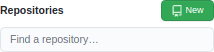

1. Fill Repository information and click the `Create repository` button.

    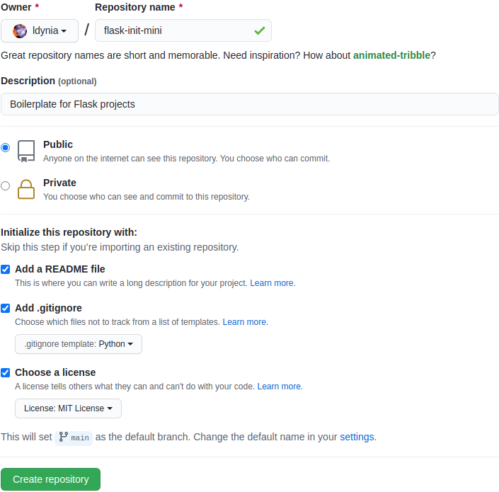

1. What's left is to create a Flask application. If you are not familiar with Flask, read the [quick start](https://flask.palletsprojects.com/en/1.1.x/quickstart/) guide. In GitHub's interface by clicking the `Add file` button and selecting `Create new file`.

    [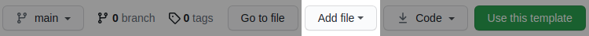](https://github.com/ldynia/flask-init-mini)

    **/app/requirements.txt**

    ```
    coverage==6.5.0
    Flask==2.2.2
    pytest==7.2.0
    ```
    **app/test_app.py**

    ```python
    import pytest

    from run import app as application


    @pytest.fixture()
    def app():
        application.config.update({
            "TESTING": True,
        })
        yield application


    @pytest.fixture
    def client(app):   
        return app.test_client()


    @pytest.fixture()
    def runner(app):
        return app.test_cli_runner()


    def test_api(client):
        response = client.get("/")
        assert response.status_code == 200
        assert b"Flask" in response.data
    ```

    **app/run.py**

    ```python
    from flask import Flask

    app = Flask(__name__)


    @app.route("/")
    def hello_world():
        return "Hello, Flask!"
    ```

    **Dockerfile**

    ```Dockerfile
    FROM python:3.9.5-alpine

    # Setup environment variables
    ENV PORT=8080 \
        HOST=0.0.0.0 \
        FLASK_APP=/app/run.py \
        PYTHONUNBUFFERED=True
    ARG FLASK_DEBUG=False
    ENV FLASK_DEBUG=$FLASK_DEBUG

    # Setup file system
    WORKDIR /app
    COPY app/ /app

    # Upgrade pip & install python packages
    RUN pip install --upgrade pip --requirement /app/requirements.txt

    # Indicate which port to expose
    EXPOSE $PORT

    # Start app server
    CMD flask run --host=$HOST --port=$PORT
    ```

    **README.md**
    ~~~
    # flask-init-mini

    This project is a boilerplate for future Flask applications.

    Below steps can be executed on any unix like system. I will use ubuntu deployed on
    [O'Reilly's sandbox](https://learning.oreilly.com/scenarios/ubuntu-sandbox/9781492062837) (alternatively you could use [Katacoda's playground](https://www.katacoda.com/courses/ubuntu/playground2004)). Once the sandbox/playground is ready, execute instructions specified in below sections.

    ## Setup SSH key

    **This step is option and can be omitted.**

    Create ssh key and add it to GitHub's [SSH keys](https://github.com/settings/keys) settings.

    ```bash
    ssh-keygen
    cat ~/.ssh/id_rsa.pub
    ```

    ## Installation

    ```bash
    # Cloning the source code
    git clone https://github.com/ldynia/flask-init-mini.git
    cd flask-init-mini

    # Building and running docker container
    docker build --tag flask-mini --build-arg FLASK_DEBUG=True .
    docker run --detach --name flask-app --publish 80:8080 --rm flask-mini
    docker ps
    ```
    ## API

    ```bash
    curl "http://localhost"
    ```

    ## Testing

    Unit test
    ```bash
    docker exec flask-app pytest
    ```

    Code coverage
    ```bash
    docker exec flask-app coverage run -m pytest
    docker exec flask-app coverage report
    ```
    
    Stop container
    ```bash
    docker stop flask-app
    ```
    ~~~

1. Let's mark repository to a template by clicking repository `Settings` tab, and selecting `Template repository` checkbox.

    [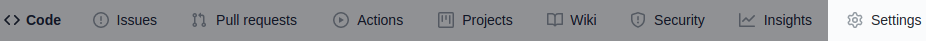](https://github.com/ldynia/flask-init-mini/settings)

    [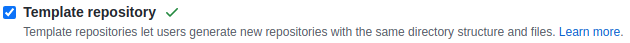](https://github.com/ldynia/flask-init-mini/settings)

## 2. Microservice

<details>
  <summary>Context</summary>

  #### What is  microservice and why to use them?

  Microservices/Microservice Architecture - is an **architectural style that structures an application as a collection of services** that are:
  - Loosely coupled.
  - Independently deployable.
  - Organized around business capabilities.
  - Highly maintainable and testable.
  - Owned by a small team.

  #### What are typical features of microservice?

  A typical microservice exposes following features:
  - Is structured around business boundaries / [bounded context](https://www.infoq.com/news/2019/06/bounded-context-eric-evans/)
  - Has independent database.
  - Communicates over the network.
  - Has well defined API.

</details>

1. Create [New Repository](https://github.com/new) and fill it in according to values listed on the image. Notice that this time we choose **flask-init-mini** project from `Repository template` as a base for our microservice.
    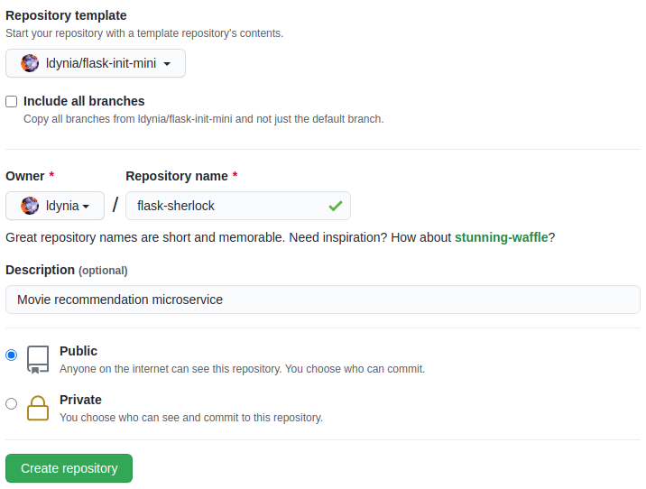

1. Click the [**Add File**](https://github.com/ldynia/flask-init-mini) button and add/update blow files.
    [](https://github.com/ldynia/flask-init-mini)

    **app/db.json**

    ```json
    [{
        "title": "Groundhog Day",
        "genre": ["comedy", "fantasy", "romance"],
        "year": 1993,
        "rating": 8.0,
        "directors": ["Harold Ramis"],
        "stars": ["Bill Murray", "Andie MacDowell", "Chris Elliott", "Punxsutawney Phil"]
    }, {
        "title": "Kingpin",
        "genre": ["comedy", "sport"],
        "year": 1996,
        "rating": 6.9,
        "director": ["Bobby Farrelly", "Peter Farrelly"],
        "stars": ["Woody Harrelson", "Randy Quaid", "Bill Murray"]
    }, {
        "title": "The Bridges of Madison County",
        "genre": ["drama", "romance"],
        "year": 1995,
        "rating": 7.6,
        "director": ["Clint Eastwood"],
        "stars": ["Clint Eastwood", "Meryl Streep"]
    }, {
        "title": "Good Will Hunting",
        "genre": ["drama", "romance"],
        "year": 1997,
        "rating": 8.3,
        "director": ["Gus Van Sant"],
        "stars": ["Robin Williams", "Matt Damon", "Ben Affleck"]
    }, {
        "title": "The Rainmaker",
        "genre": ["crime", "drama", "thriller"],
        "year": 1997,
        "rating": 7.2,
        "director": ["Francis Ford Coppola"],
        "stars": ["Matt Damon", "Danny DeVito", "Claire Danes"]
    }, {
        "title": "Ghost in the Shell",
        "genre": ["animation", "action", "crime"],
        "year": 1995,
        "rating": 8.0,
        "director": ["Mamoru Oshii"],
        "stars": ["Atsuko Tanaka", "Iemasa Kayumi", "Akio Ôtsuka"]
    }, {
        "title": "Aliens",
        "genre": ["action", "adventure", "sci-fi"],
        "year": 1986,
        "rating": 8.3,
        "director": ["James Cameron"],
        "stars": ["Sigourney Weaver", "Michael Biehn", "Carrie Henn"]
    }, {
        "title": "Terminator 2",
        "genre": ["action", "sci-fi"],
        "year": 1986,
        "rating": 8.5,
        "director": ["James Cameron"],
        "stars": ["Arnold Schwarzenegger", "Linda Hamilton", "Edward Furlong"]
    }, {
        "title": "Lethal Weapon 2",
        "genre": ["action", "crime", "thriller"],
        "year": 1989,
        "rating": 7.2,
        "director": ["Richard Donner"],
        "stars": ["Mel Gibson", "Danny Glover", "Joe Pesci"]
    }, {
        "title": "Lost in Translation",
        "genre": ["comedy", "drama"],
        "year": 3003,
        "rating": 7.7,
        "director": ["Sofia Coppola"],
        "stars": ["Bill Murray", "Scarlett Johansson", "Giovanni Ribisi"]
    }]
    ```

    **app/rengine.py**

    ```python
    import random


    class Sherlock():
        """
        Movies recommendation engine.
        """

        def __init__(self, movies, features):
            self.movies = movies
            self.title = features.get("title")
            self.features = ["genre", "stars"]

        def recommend(self):
            """
            Algorithm recommends movies based on default movie features.
            The algorithm uses partial match as search criteria and returns sorted list of movie(s).
            """
            ref_movie = self.__get_movie(self.title)
            if not ref_movie:
                return self.__lucky_recommendation(self.movies)
            ref_movie = ref_movie[0]

            movies = []
            for movie in self.movies:
                if movie["title"] != self.title:
                    for feature in self.features:
                        feature_match = [fm in movie[feature] for fm in ref_movie[feature]]
                        if any(feature_match):
                            movies.append(movie)
                            break

            return sorted(movies, key=lambda movie: movie["rating"], reverse=True)


        def __lucky_recommendation(self, movies):
            """
            I feel lucky - random choice.
            """
            return [random.choice(movies)]

        def __get_movie(self, title):
            """
            Find movie by title.
            """
            movie = [movie for movie in self.movies if movie["title"] == title]
            return movie if movie else []
    ```

    **app/run.py**

    ```python
    import os
    import json
    from json.decoder import JSONDecodeError

    from flask import Flask
    from flask import jsonify
    from flask import request

    from rengine import Sherlock


    # Set up app
    app = Flask(__name__)
    app.json.ensure_ascii = False
    APP_DIR = os.path.dirname(os.path.realpath(__file__))

    def read_data(source):
        """
        Reads file that is expected to hold JSON encoded content.
        In case of errors return empty data and list holding error message.
        """
        data = []
        errors = []
        try:
            with open(source) as db:
                content = db.read()
            data = json.loads(content)
        except FileNotFoundError as e:
            errors = [f"Reading {source}, {str(e)}"]
        except JSONDecodeError as e:
            errors = [f"Reading {source}, {str(e)}"]
        except Exception as e:
            errors = [f"Reading {source}, {str(e)}"]

        return data, errors


    @app.route("/api/v1/movies/recommend", methods=["GET"])
    def recommend():
        """
        Function loads movies from db and returns recommendations.
        """
        MOVIES, errors = read_data(f"{APP_DIR}/db.json")
        if errors:
            return jsonify({"errors": errors, "status_code": 500}), 500

        sherlock = Sherlock(MOVIES, request.args)
        recommendation = sherlock.recommend()

        return jsonify(recommendation)
    ```

    **/app/test_app.py**

    ```python
    import pytest

    from run import app as application


    @pytest.fixture()
    def app():
        application.config.update({
            "TESTING": True,
        })
        yield application


    @pytest.fixture
    def client(app):   
        return app.test_client()


    @pytest.fixture()
    def runner(app):
        return app.test_cli_runner()


    def test_api(client):
        response = client.get("/api/v1/movies/recommend")
        assert response.status_code == 200
        assert response.is_json
        assert response.get_json()[0]["title"] != ""

        response = client.get("/api/v1/movies/recommend?title=Kingpin")
        assert response.status_code == 200
        assert response.is_json
        assert len(response.get_json()) >= 2

        response = client.get("/api/v1/movies/recommend?title=Lost%20in%20Translation")
        assert response.status_code == 200
        assert response.is_json
        assert len(response.get_json()) >= 5
    ```

    **README.md**

    ~~~
    # Sherlock

    Welcome to Sherlock project. Sherlock is a movie recommendation microservice written in Flask.

    Below steps can be executed on any unix like system. I will use ubuntu deployed on [O'Reilly's sandbox](https://learning.oreilly.com/scenarios/ubuntu-sandbox/9781492062837) (alternatively you could use [Katacoda's playground](https://www.katacoda.com/courses/ubuntu/playground2004)). Once the sandbox/playground is ready, execute instructions specified in below sections.

    ## Setup SSH key

    **This step is option and can be omitted.**

    Create ssh key and add it to GitHub's [SSH keys](https://github.com/settings/keys) settings.

    ```bash
    ssh-keygen
    cat ~/.ssh/id_rsa.pub
    ```

    ## Installation

    ```bash
    # Cloning the source code
    git clone https://github.com/ldynia/flask-sherlock.git
    cd flask-sherlock

    # Building and running docker container
    docker build --tag flask-sherlock --build-arg FLASK_DEBUG=True .
    docker run --detach --name sherlock --publish 80:8080 --rm flask-sherlock
    docker ps
    ```

    ## API

    Filter up algorithm
    ```bash
    curl "http://localhost/api/v1/movies/recommend?title=Kingpin"
    curl "http://localhost/api/v1/movies/recommend?title=Lost%20in%20Translation"
    ```

    ## Testing

    Unit test
    ```bash
    docker exec sherlock pytest
    ```

    Code coverage
    ```bash
    docker exec sherlock coverage run -m pytest
    docker exec sherlock coverage report
    ```
    
    Stop container
    ```bash
    docker stop sherlock
    ```
    ~~~

1. Follow instructions in `Installation`, `Testing` and `API` sections.

## 3. GitHub Issues

<details>
  <summary>Context</summary>

  #### What are GitHub Issues?

  GitHub Issues is a tool for keeping track of tasks, bugs and feedback for your project.

  #### Why to use GitHub Issues?

  It's just a convenient way to manage all affairs related to your project.

</details>

1. In repository tabs click [Issues](https://github.com/ldynia/flask-sherlock/issues). Next, click the [New issue](https://github.com/ldynia/flask-sherlock2/issues/new) button. Fill the form with text specified on the image below, then click the `Submit new issue` button.

    [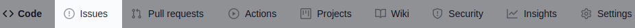](https://github.com/ldynia/flask-sherlock/issues)
    [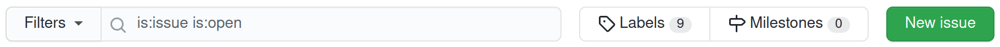](https://github.com/ldynia/flask-sherlock/issues/new)
    [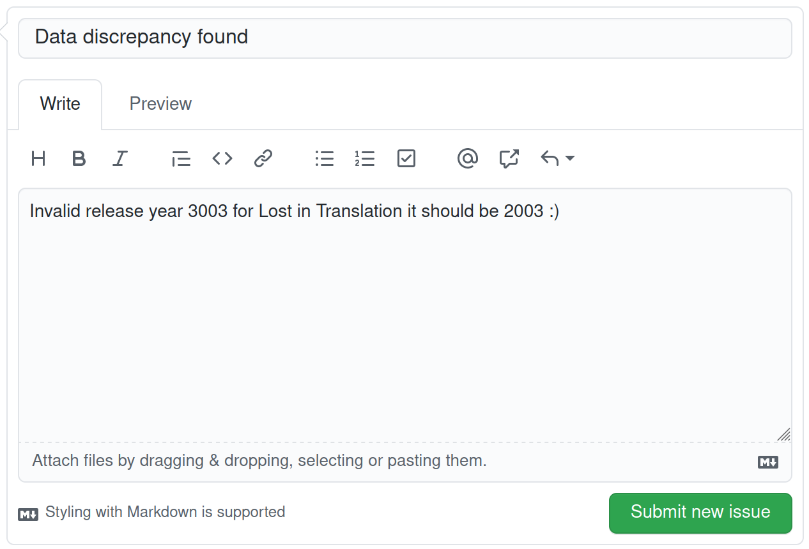](https://github.com/ldynia/flask-sherlock/issues/new)


## 4. GitHub Releases / Tags

<details>
  <summary>Context</summary>

  It's very seldom that your software will be released only in one version, e.g. `v1.0.0`. As your project grows, you will have a bug to fix and feature to add. GitHub Releases allows you to create tagged artifacts of your software.

</details>

1. In your repository click [tags](https://github.com/ldynia/flask-sherlock/tags) icon.

    [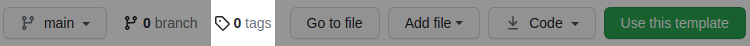](https://github.com/ldynia/flask-sherlock/tags)

1. Click the `Releases` tab, next click `Create a new release` button, fill it with information specified on the picture below. Once done click the `Publish release` button.

    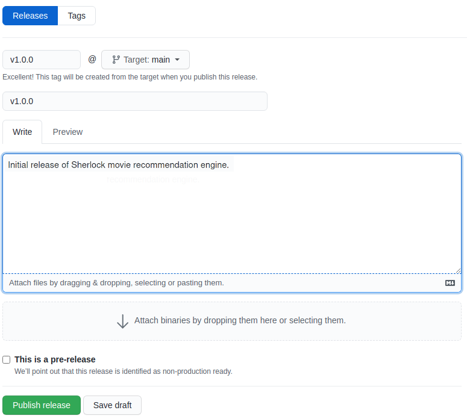

## 5. GitHub Actions

<details>
  <summary>Context</summary>

  #### What is GitHub Actions?

  GitHub Actions is a tool that allows you to automate tasks within your software development life cycle. GitHub Actions are event-driven, which means that commands that you want to execute run after occurrence of a specified event.

  #### Why to use GitHub Actions?

  GitHub Actions allows you to adopt backbone of DevOps methodology such CI/CD.

  #### Explenation

  - **Continuous Integration** goal is to enable automated way to build, package, and test applications.
  - **Continuous Delivery** goal is to automate the delivery of applications to given environment (test or production) via manual release.
  - **Continuous Deployment** goal is to automated release of code to a production environment.

  #### Books

  [The Toyota Way: 14 Management Principles](https://www.goodreads.com/book/show/161789.The_Toyota_Way)

</details>

1. In the repository click the [Actions](https://github.com/ldynia/flask-sherlock/actions) tab. Then click [set up a workflow yourself](https://github.com/ldynia/flask-sherlock2/new/main?filename=.github%2Fworkflows%2Fmain.yml&workflow_template=blank) link and create below workflows. **Remember to change username !!!**

    [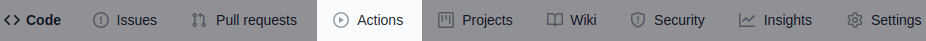](https://github.com/ldynia/flask-sherlock/actions)
    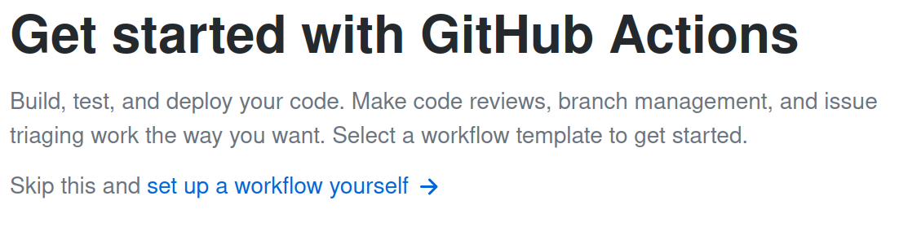

    **.github/workflows/ci.yml**

    ```yaml
    name: Continuous Integration
    on: [ pull_request, workflow_dispatch ]
    jobs:
      unit_test:
        runs-on: ubuntu-latest
        env:
          CODE_COVERAGE_THRESHOLD: 90
        strategy:
          matrix:
            python-version: [3.7, 3.8]
        steps:
         - uses: actions/checkout@v2
         - name: Set up Python ${{ matrix.python-version }}
           uses: actions/setup-python@v2
           with:
            python-version: ${{ matrix.python-version }}
         - name: Install python dependencies
           run: pip install -r app/requirements.txt
         - name: Run flask app
           run: |
             export FLASK_APP=$PWD/app/run.py
             flask run &
         - name: Run unit test
           run: coverage run -m pytest app/
         - name: Print unit test report
           run: coverage report
         - name: Validate code coverage
           run: |
             COVERAGE=$(coverage report | tail -n 1 | awk '{print $4}' | head -c 2)
             if [ "$COVERAGE" -lt "$CODE_COVERAGE_THRESHOLD" ]; then
               echo "Error: Code coverage cannot be smaller than $CODE_COVERAGE_THRESHOLD%, got $COVERAGE%"
               exit 1
             fi
      publish:
        if: "github.event_name == 'workflow_dispatch'"
        runs-on: ubuntu-latest
        needs:
          - unit_test
        env:
            IMAGE_ARTIFACT: ${{ secrets.DOCKER_HUB_USERNAME }}/sherlock:latest
        environment: production
        steps:
         - uses: actions/checkout@v2
         - name: Login to DockerHub
           run: docker login -u ${{ secrets.DOCKER_HUB_USERNAME }} -p ${{ secrets.DOCKER_HUB_PASSWORD }}
         - name: Build docker image
           run: docker build --tag flask-sherlock $GITHUB_WORKSPACE
         - name: Tag docker image
           run: docker tag flask-sherlock $IMAGE_ARTIFACT
         - name: Push image to DockerHub
           run: docker push $IMAGE_ARTIFACT
    ```

1. What's missing are `DOCKER_HUB_USERNAME` and `DOCKER_HUB_PASSWORD` environment variables which are our secrets. Go to repository [Settings](https://github.com/ldynia/flask-sherlock/settings), click [Environments](https://github.com/ldynia/flask-sherlock/settings/environments) blade, then click [New Environment](https://github.com/ldynia/flask-sherlock/settings/environments/new) button, name it **production**. Next, click the `Configure environment` button. Finally, click the `Add Secret` button and add [DockerHub](https://hub.docker.com/settings/security) secrets.

    
    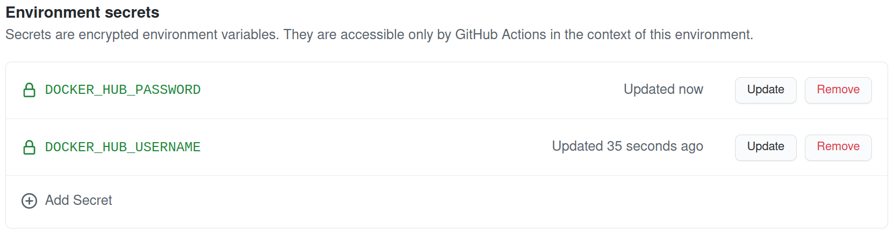


1. Now in [Actions](https://github.com/ldynia/flask-sherlock/actions) you will see below workflows. Select `Continuous Integration` blade, then click the `Run Workflow` button, and run workflow against the **main** branch.

    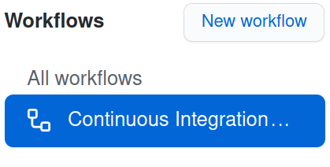
    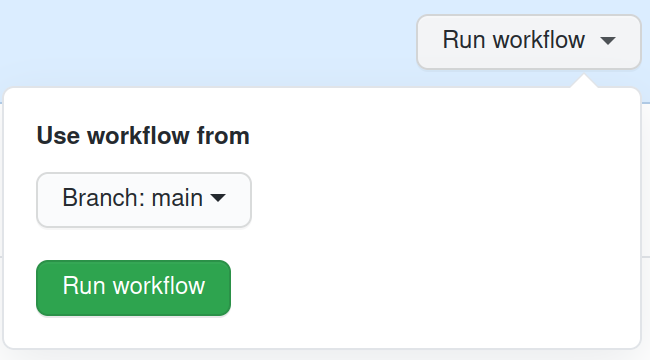

1. Check that our image appears in [DockerHub Repositories](https://hub.docker.com/repositories)

## 6. GitHub Pull Request

<details>
  <summary>Context</summary>

  #### What is a Pull Request?

  A pull request (PR) is a feature of a git hosting service that allows to create a contribution to the repository. PRs allow the maintainer of a repository to review, ask for comments, edit or even discard submitted work. I like to think of a PR as a tangible unit of work in a collaborative world of code.

</details>

1. Fork repository by going to [https://github.com/ldynia/flask-sherlock](https://github.com/ldynia/flask-sherlock) and click `Fork` button. Next, in your fork create a new branch called  **db/update**

    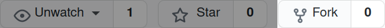
    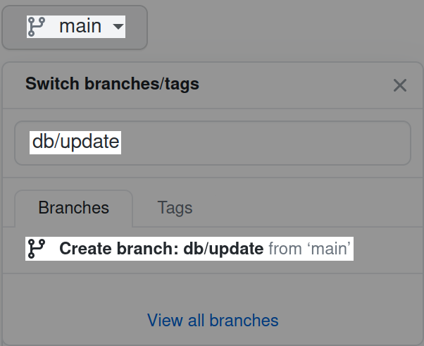

1. Update `/app/db.json` with your favorite movie and set commit message to **Adding my favorite movie**. **Remember to stick to JSON encoding !!!**

    ```json
    {
        "title": "The Ghost Writer",
        "genre": ["crime", "drama", "mystery"],
        "year": 2010,
        "rating": 7.2,
        "director": ["Roman Polański"],
        "stars": ["Ewan McGregor", "Pierce Brosnan", "Olivia Williams"]
    }
    ```

1. Go to your repository [https://github.com/kigetj/flask-sherlock](https://github.com/kigetj/flask-sherlock) and click the [Pull Request](https://github.com/kigetj/flask-sherlock/pulls) tab, then click the `Compare & pull request` button. Finally, write a comment and click the `Create pull request` button.

    [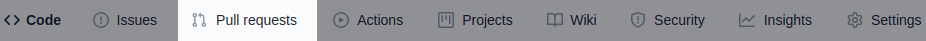](https://github.com/kigetj/flask-sherlock/pulls)
    [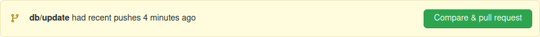](https://github.com/ldynia/flask-sherlock/compare/main...kigetj:db/update?expand=1)
    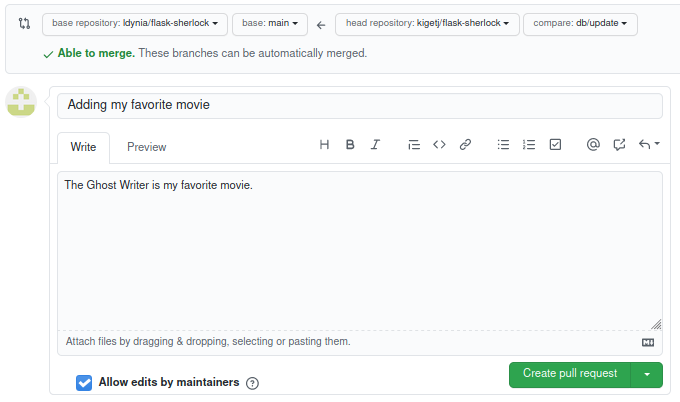
    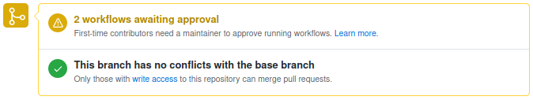

## 7. GitHub Advanced Search

- [https://github.com/search](https://github.com/search)
- [GitHub search docs](https://docs.github.com/en/github/searching-for-information-on-github/searching-on-github)

<details>
  <summary>Copy</summary>

  - `if extension:yaml extension:yml path:.github/workflows language:YAML`
  - `HEALTHCHECK filename:Dockerfile language:Dockerfile`
  - `flask in:name,description`

</details>

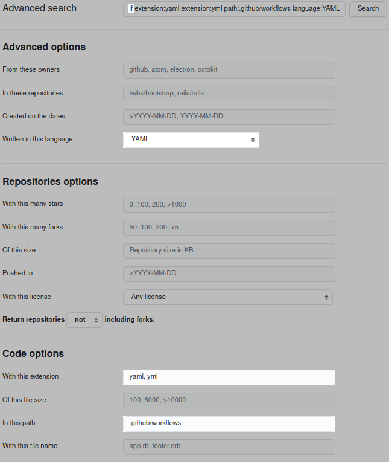
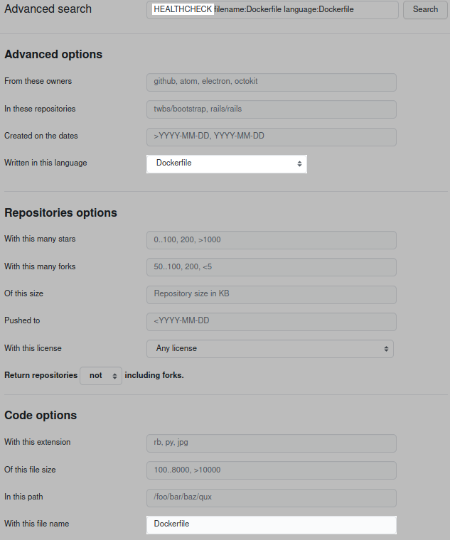


## 8. GitHub Pages

<details>
  <summary>Context</summary>

  #### What is GitHub Pages?

  GitHub Pages is a hosting service for static sites. GitHub Pages serves any static files (HTML, CSS, JavaScript) that you push to repository. You can create your own static files or use a static site generator such [Jekyll](https://jekyllrb.com/docs/) to build your site for you.

  #### Why to use GitHub Pages?

  The short answer is for **branding** and **promotion**. You can use it for blogging, or as a journal of your work. You can promote yourself with `my_username.github.io` or your project `my_username.github.io/my_project`. Moreover, you have option to brand your work with a custom domain.

</details>

1. In repository settings [Settings](https://github.com/ldynia/flask-sherlock/settings) locate [Pages](https://github.com/ldynia/flask-sherlock/settings/pages) tab. Set `Source` to the **main** branch and `directory` to **/docs** and click the`Save` button.

    [](https://github.com/ldynia/flask-sherlock/settings)
    [](https://github.com/ldynia/flask-sherlock/settings/pages)

1. Click `Choose a theme` button and select `Cayman` theme (I like it the most) then click `Select theme` button. Finally, copy and paste below content into the interface that you see, or into `docs/index.md`

    ~~~
    ## Sherlock

    [webpage](https://ldynia.github.io/flask-sherlock/)

    Sherlock is the best movie recommendation engine ever created. Isn't it Dr. [Jekyll](https://jekyllrb.com/)? More advanced references please look up how [Jekyll docs](https://github.com/jekyll/jekyll/tree/master/docs) are structured.

    

    ## Multiverse

    ```bash
    $ echo Hello, bash!
    ```

    ```python
    >>> print('Hello, python!')
    ```

    #### Markdown 101

    Markdown is a lightweight and easy-to-use syntax for styling your writing. It includes conventions for

    ```markdown
    Syntax highlighted code block

    > Quotes "Life is like box o chocolates"

    # Header 1
    ## Header 2
    #### Header 3

    - Bulleted
    - List

    1. Numbered
    2. List

    **Bold** and _Italic_ and `Code` text

    [Link](url) and 
    ```
    ~~~

1. Configure [themen]([url](https://docs.github.com/en/pages/setting-up-a-github-pages-site-with-jekyll/adding-a-theme-to-your-github-pages-site-using-jekyll)) `docs/_config.yml`

   ```
   markdown: kramdown
   theme: minima
   ```
   

1. Once ready you will be able to promote you project at this url [https://ldynia.github.io/flask-sherlock/](https://ldynia.github.io/flask-sherlock/) **Remember to change username !!!**

## 9. GitHub Wikis

<details>
  <summary>Context</summary>

  Wiki is an important part of an open source project. `READEME.md` is intended to be used as a brief documentation on how to get started with a project. `Wiki` on the other hand are intended to provide information about the project that can't be expressed by code.

</details>

1. On the main page of your repository click [Wiki](https://github.com/ldynia/flask-sherlock/wiki) tab.

    [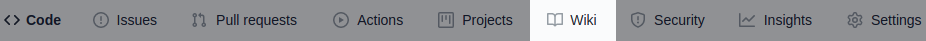](https://github.com/ldynia/flask-sherlock/wiki)

1. Next we will create below pages by clicking the [`Create Page`](https://github.com/ldynia/flask-sherlock/wiki/_new) button.

    **Home**

    ~~~
    # Welcome to the flask-sherlock wiki!

    Wiki is an important part of an open source project. `READEME.md` is intended to be used as a brief documentation on how to get started with a project. `Wiki` on the other hand are intended to provide documentation of the project that can't be expressed by code.
    ~~~

    **Agile Manifesto**

    ~~~
    # [Manifesto for Agile Software Development](https://agilemanifesto.org/)

    While there is value in the items on the right, we value the items on the left more:

    * Individuals and interactions over processes and tools
    * Working software over comprehensive documentation
    * Customer collaboration over contract negotiation
    * Responding to change over following a plan
    ~~~

    **Code of Conduct**

    ~~~
    # [Kubernetes Code of Conduct](https://kubernetes.io/community/code-of-conduct/)

    As contributors and maintainers of this project, and in the interest of fostering an open and welcoming community, we pledge to respect all people who contribute through reporting issues, posting feature requests, updating documentation, submitting pull requests or patches, and other activities.

    We are committed to making participation in this project a harassment-free experience for everyone, regardless of level of experience, gender, gender identity and expression, sexual orientation, disability, personal appearance, body size, race, ethnicity, age, religion, or nationality.

    Examples of unacceptable behavior by participants include:
    * The use of sexualized language or imagery
    * Personal attacks
    * Trolling or insulting/derogatory comments
    * Public or private harassment
    * Publishing other's private information, such as physical or electronic addresses, without explicit permission
    * Other unethical or unprofessional conduct.
    ~~~

    **_Sidebar**

    **Remember to change username !!!**

    ~~~
    # Shortcuts

    * [Home](https://github.com/ldynia/flask-sherlock/wiki/Home)
    * [Agile Manifesto](https://github.com/ldynia/flask-sherlock/wiki/Agile-Manifesto)
    * [Code of Conduct](https://github.com/ldynia/flask-sherlock/wiki/Code-of-Conduct)
    ~~~

    **_Footer**

    ~~~
    Sherlock project is awesome!
    ~~~
